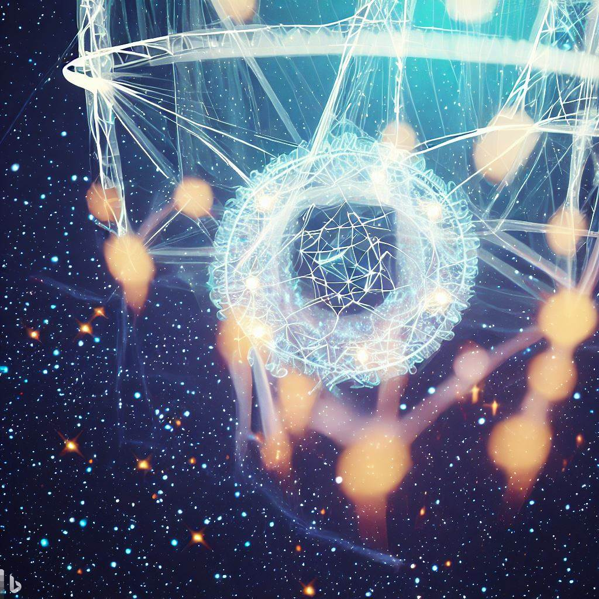

_"The Dawn of Democratised Innovation Attribution"_

<!--truncate-->

In the realm of collaborative innovation, a fundamental question often arises: "Who should receive the fruits of the collective labour?" The answer is often a tangle of complexity, especially when the collaborative process involves numerous contributors over extended periods. Dreamcatcher.land, an open, packetised innovation market, proposes a compelling solution to this problem, serving as a powerful foundation for a more advanced concept: the Dreamcatcher AI. This blog post will explore how Dreamcatcher AI extends the principles of Dreamcatcher.land to build a democratic, data-driven innovation attribution system.

## The Foundation: Dreamcatcher.land

Dreamcatcher.land is a fascinating innovation machine that directly links economic reward to the value of members' contributions, whether they're involved in funding, buying, or building and selling software. This platform operates on the concept of 'Packets', unitary pieces of software or documented knowledge verified by Quality Guardians, which address identified needs. Once a packet is deemed 'done', it acts like immutable equity attributed to all contributing members. This equity can be traded and generate revenue streams, providing a clear reward for contributions. 

The platform's appeal is further enhanced by its ability to reuse and recombine packets across multiple apps, speeding up development and potentially offsetting costs. If reused packets prove useful, Dreamcatcher tracks attribution automatically, ensuring a passive income stream for original contributors. 

The roles within Dreamcatcher's ecosystem are also worth highlighting. Funders inject capital into projects, with the platform's quality assurance process ensuring that the funded work corresponds to their expectations and that payments are released only for packets that contribute to turning their request into a product. 'Do-ers', the innovators who bring packets to life, can work without arbitrary gatekeepers, earning revenue based on the quality of their work. Buyers, on the other hand, are valued for their needs and rewarded for their product requests, contributing to the innovation process from the demand side.

## The Evolution: Dreamcatcher AI

Building upon the Dreamcatcher.land foundation, Dreamcatcher AI represents the next evolutionary step in this democratic approach to innovation. It is an attribution artificial intelligence system built on the data generated from the packet-based innovation protocol of Dreamcatcher.land.

This AI system is designed to answer the often challenging question of revenue distribution based on individual contributions. It examines the vast dataset of interactions on the platform, learns from these experiences, and applies this knowledge to generate fair, informed attribution decisions. With every interaction from any member, the AI deepens its learning, continuously improving its decision-making capabilities.

Moreover, Dreamcatcher AI introduces an interesting feedback loop that allows members to signal their dissatisfaction with the AI's output, effectively 'teaching' the AI what they believe the attribution should be. This mechanism enables continuous adjustment of the AI's decision-making processes, embodying the spirit of continuous democracy. Every interaction, every feedback point contributes to this ongoing learning process, refining the system's understanding and making it ever more accurate and fair in its attributions.

## Democratising Innovation Attribution

The Dreamcatcher AI brings to life a revolutionary concept: a democratized, data-driven system of innovation attribution. It encourages active participation from all members, learning from their interactions and feedback to refine its understanding of fair attribution. This serves not just to improve the AI's decision-making abilities, but also to make the entire process more transparent and equitable.

Furthermore, the AI system provides a clear mechanism for members to express their views on attribution, ensuring their voices are heard and considered in the decision-making process. The integration of these feedback loops represents a fundamental shift in how innovation ecosystems can operate, moving from a static, hierarchical structure to a dynamic, democratised system.

To conclude, Dreamcatcher AI stands at the forefront of a new era of innovation, where data-driven decisions and democratic processes combine to deliver fair and transparent attribution. As members interact with the system, they are not just passive participants but active contributors to the AI's learning. Every interaction, every piece of feedback, is a step towards refining the system and making it more reflective of the collective will of the members. This continuous democratic process holds immense potential for the future of collaborative innovation, painting a promising picture of what's to come. 

Through the combined power of Dreamcatcher.land's packet-based innovation protocol and Dreamcatcher AI's learning and feedback mechanism, we are witnessing a paradigm shift in how we approach innovation. This harmonious blend of technology and democracy brings us closer to a future where every contributor is adequately recognised and rewarded, catalysing a more inclusive and sustainable innovation ecosystem.