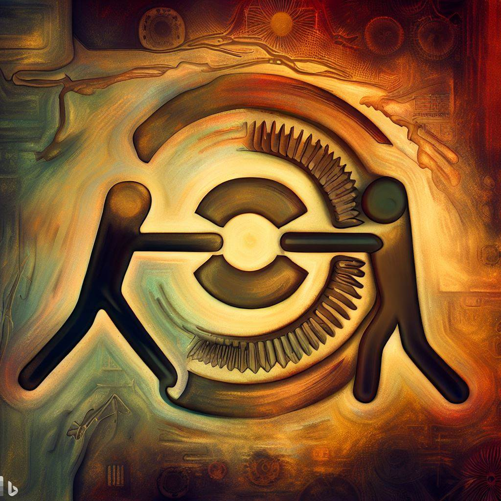

_"Restoring Fair Reward: Dreamcatcher's Packet-Based Innovation Rekindles the Ancient Link between Contribution and Attribution"_

<!--truncate-->

From the earliest days of humanity, the drive to contribute and to be fairly rewarded for our effort has been a fundamental part of our nature. This primal, animalistic desire for fair attribution has influenced the formation of societies, economies, and even our individual identities. Yet, in our current economic system, it appears that the link between contribution and reward, between effort and income, has become increasingly tenuous. The flow of wealth from its source to those who contribute to its creation seems distorted and, in some cases, corrupted. This raises the question: how can we restore this essential link? The answer may lie in an innovative approach – packet-based innovation.

Dreamcatcher, an open, packetized innovation market, offers a groundbreaking solution to this problem. By employing a packet-based innovation model, it reinstates the direct connection between economic reward and the value of members' contributions. In this system, members deal in 'Packets' - unitary pieces of software or documented knowledge whose quality has been verified by a trusted, disinterested Quality Assurance (QA) process, and which address an identified need.

In essence, each packet represents a quantifiable unit of contribution. The QA process ensures that each packet meets a certain standard of quality, removing ambiguity and ensuring that all contributions are assessed fairly. This system allows Dreamcatcher to connect economic rewards directly to the value of a member's contribution, reinforcing the link between effort and income that seems to have drifted in the traditional capitalistic model.

Furthermore, Dreamcatcher's model also ensures fair attribution. Once a packet is deemed 'done', it acts like immutable equity that cannot be diluted or taken away. It is owned by all members who contributed to its creation. This innovative approach ensures that those who contribute are fairly and directly rewarded for their efforts, reinforcing the connection between contribution and attribution.

Moreover, the ability to reuse and recombine packets in multiple applications allows for the creation of passive income streams for the original contributors, further strengthening the link between effort and reward. 

In Dreamcatcher's packet-based innovation market, all members, including funders, do-ers, and buyers, have an equal opportunity to contribute and receive fair reward for their efforts. The QA process ensures that the work done meets the required standards and that the funds are used effectively. Do-ers are rewarded based solely on the quality of their work, and buyers, by virtue of their demand for a product, share in the rewards when the product is built and used.

In conclusion, packet-based innovation presents a promising avenue for restoring the ancient, primal link between contribution and attribution. By breaking down innovation into quantifiable, quality-assured packets, Dreamcatcher's model ensures that every contribution is fairly rewarded, effectively addressing the distortions and corruptions seen in the traditional flow of wealth. By restoring this essential link, packet-based innovation offers not only a more equitable approach to economic reward, but also a more inclusive and sustainable model for the future of innovation.