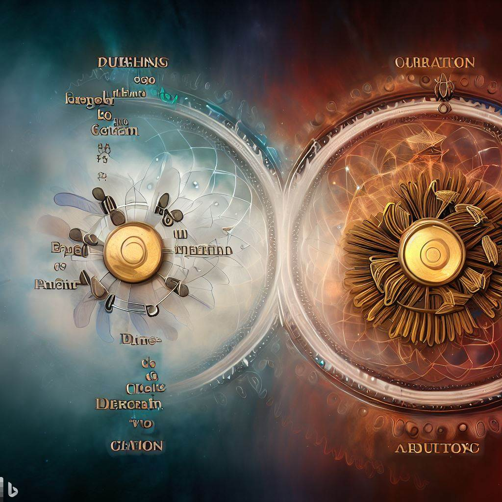

_"The Art and Science of Fair Attribution: Apportioning Rewards in the Dreamcatcher Ecosystem"_

<!--truncate-->

In the Dreamcatcher ecosystem, the value of everyone's contributions is recognized and rewarded, thanks to a unique model of attribution. But how does one decide what counts as a "contribution"? And what's more, how does one determine the relative weight of different kinds of contributions? In this post, we'll explore the only two kinds of decisions that need to be made in the Dreamcatcher system in order to answer these questions.

## 1. Apportioning Fairly Among Contributions

:::tip Solver vs Solver
What is the value of one members solving vs the solving of the other members ?
:::

Every outcome in the Dreamcatcher ecosystem is the result of various individual contributions. These could be ideas, funding, software development, QA testing, and more. The question then becomes: how do we apportion attribution fairly among these different contributors?

To begin with, it's essential to understand that Dreamcatcher operates on the principle of "impact" rather than "effort". That is, the weight of a contribution is measured not by how much time or energy was invested in it, but by its actual impact on the final outcome. 

A robust algorithmic model underpins this decision-making process, assessing the value of each contribution based on a range of parameters. These might include the significance of the contribution to the project, the complexity of the work, and the novelty of the idea, among others. 

Moreover, Dreamcatcher's system is designed to be dynamic and adaptable. As projects evolve and contributions gain or lose relevance, the algorithm adjusts the attribution accorded to each contributor accordingly. This ensures that the attribution system remains fair and accurate, reflecting the ever-changing reality of the project.

## 2. Balancing Attribution Between Funders, Solvers, and Dependencies

:::tip Funder vs Solver vs Dependencies
What is the value of the Funders input vs the Solvers input vs the Dependencies utilized by the Solution ?
:::

The second decision concerns the division of attribution between three key player groups in the Dreamcatcher ecosystem: Funders, Solvers, and Dependencies.

Funders provide the financial resources necessary to bring a project to fruition. Solvers, on the other hand, are the individuals or teams that translate these resources into tangible outputs—be it a piece of software or a brilliant idea. Dependencies represent the pre-existing work or foundational elements upon which new projects are built.

Each of these groups plays a critical role, and each should receive fair attribution. But what does "fair" mean in this context?

The key lies in recognizing the unique value brought by each group. Funders provide the means, Solvers provide the skill and creativity, and Dependencies provide the groundwork. Each of these inputs is essential to the project, and the attribution model should reflect that.

Attribution is therefore divided proportionally based on the value that each group adds to the project. The exact proportions can vary depending on the project, but the principle remains the same: attribution should reflect the true value of each contribution.

Just as with individual contributors, this process is also dynamic. As the project evolves and the relative importance of funding, solving, and dependencies changes, so too does the distribution of attribution.

## Conclusion

Dreamcatcher's attribution model is a complex system, designed to fairly and accurately reward all contributors to a project. The two kinds of decisions described here—apportioning among contributions, and balancing between Funders, Solvers, and Dependencies—are the pillars of this system.

Though the algorithmic models underpinning these decisions are complex, the principle is simple: value is rewarded, impact is recognized, and everyone gets their fair share. That's the Dreamcatcher way.