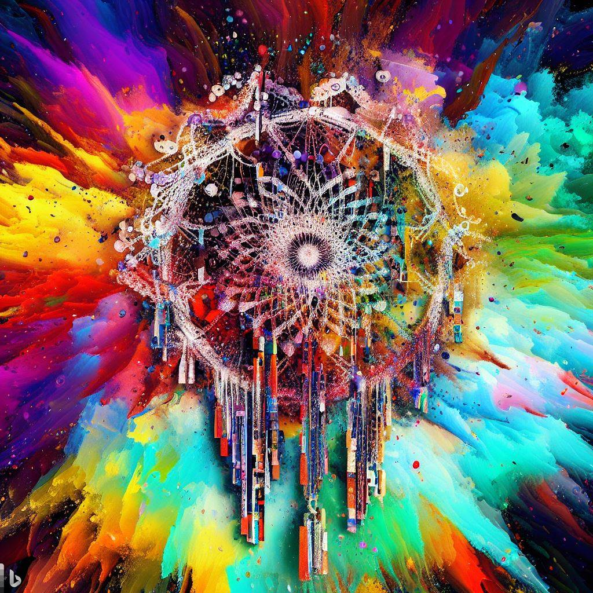

_"Gen3 Blockchains: Where Contributions Shape Value and Consumers Drive Change"_

<!--truncate-->

1. **Direct Connection and Micropayments**: Blockchain enables direct, peer-to-peer transactions, allowing Dreamcatcher to connect economic rewards to the value of members' contributions. This technology also facilitates efficient microtransactions, incentivizing every contribution, big or small.

2. **Open and Incentivised**: Blockchain provides the infrastructure for an open and global platform, allowing anyone, anywhere to contribute without permission in an open market that transforms ideas into products.

3. **Packetised and Quality Guardians**: Dreamcatcher's members deal in 'Packets' - unitary pieces of software or documented knowledge. Blockchain ensures the integrity and ownership of these digital assets. Additionally, it facilitates a reputation system for QA Guardians, who vet these packets.

4. **Immutable Attribution and Recombination**: Blockchain ensures that once 'done', Packets act as immutable equity. They can be traded and generate revenue streams, thereby incentivizing their reuse and improvement. Dreamcatcher also utilizes blockchain to automatically track attribution, ensuring a passive income stream for the original contributors.

5. **Decentralization and Censorship Resistance**: Dreamcatcher employs a decentralized model of operation. Each application makes its own dedicated set of blockchains for each project, making censorship challenging and ensuring the free expression and development of ideas.

6. **Ownership and Privacy**: Dreamcatcher allows each idea to be free-floating, owned by no-one except the blockchain rules, and optionally kept private. Projects, free of any centralized control, can interact with other systems at their discretion, enhancing collaboration and innovation while maintaining individual contribution ownership and privacy.

7. **Consumer-Centric Operation**: Inverted apps put their consumers first and coordinate while being fractured into many pieces. They utilize inverted capital allocation mechanisms enabled by Dreamcatcher to perform functions that benefit their consumers, not their controllers.  In contrast to most distributed and decentralized apps where central control is still present in the form of a token or a central registry of intent, inverted apps have no central coordination of intent. Any central tendencies emerge naturally and are apparent when entities communicate, promoting a consumer-focused approach to app operation and development

8. **Accessible and Fluid Exchange**: An "inverted" exchange, as conceptualized in Dreamcatcher, allows any participant with commodity electronics to engage, mitigating barriers often found in traditional exchanges. This facilitates peer-to-peer interactions, enabling individuals to find the best prices.

In summary, Dreamcatcher leverages the power of blockchain to create an innovative, consumer-centric ecosystem where value is directly tied to contributions, facilitated by efficient microtransactions. The platform fosters an open, incentivized environment where anyone can contribute, creating 'Packets' of documented knowledge or software that undergo stringent quality checks, thus ensuring their integrity and ownership. These packets, acting as immutable equity, can be traded and reused, generating revenue streams and encouraging continuous improvement. 

Dreamcatcher's decentralized operation, coupled with its commitment to ownership and privacy, ensures a resilient platform resistant to censorship and conducive to free expression. The platform's focus on consumer-centric operation is manifested in its inverted apps, which prioritize consumers and coordinate in a decentralized manner.