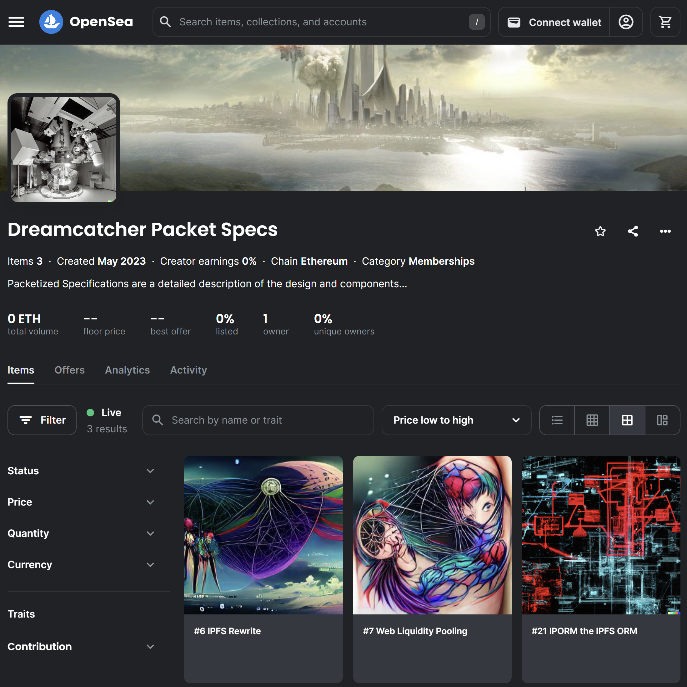

_"Transforming Tasks into NFTs: When Events become Things in the Packet-Based Innovation System"_

<!--truncate-->

In an increasingly interconnected world, innovation often emerges from unexpected intersections. In the pervasive interconnectedness of the digital world, the Dreamcatcher platform introduces a novel approach to task management. By leveraging the capabilities of Non-Fungible Tokens (NFTs), the Dreamcatcher introduces a system where tasks are transformed into NFTs that are termed 'Packets'. This conversion allows tasks, now manifested as Packets, to obtain an existence characterized by tangibility, tradability, and transparency. The core principle behind this transformation is reminiscent of packet-switched networks, wherein data is segmented into distinct packets that are independently routed.

Dreamcatcher's platform decentralizes and breaks down ideas or innovations into smaller parts, facilitating their independent evolution. This concept draws a parallel with Uber's packet-switched labor model, which paves the way for a flexible workforce. Dreamcatcher expands this idea to the domain of innovation, where Packets, representing tasks as NFTs, emerge as dynamic entities. These entities fuel collective innovation, diverging from the traditional model where a single organization or entity dictates the progress. Despite the inherent challenges, this model shapes a resilient and adaptive innovation network, one that readily embraces discontinuity and transformation processes.

In its initial iteration, the Dreamcatcher platform, built on the Ethereum blockchain, utilizes a smart contract to hold funds in escrow. This provides workers with the confidence that they will receive payment for their contributions and offers collaborative funders a clear view of the contributions made by each participant. Additionally, these Packets can be freely traded on platforms like OpenSea, enriching the market's depth.

Harnessing the power of blockchain, Dreamcatcher establishes a direct link between economic rewards and the value of members' contributions. This technology guarantees the integrity and ownership of these Packets, each representing a single unit of software or documented knowledge. The Packets can be exchanged based on their anticipated future value, serving both as a record of contribution and a target for attribution, thereby incentivizing innovation.

The platform also offers a mechanism for identifying and merging duplicate Packets, thereby promoting resource sharing and efficiency. By symbolizing tasks as NFTs or Packets, Dreamcatcher facilitates the generation of auto-updating project roadmaps that can be disseminated across separate companies.

In summary, Dreamcatcher's approach fosters transparency and efficiency in innovation networks. By translating tasks into Packets, it gives rise to a dynamic, resilient, and adaptive network that directly correlates value with individual contributions.