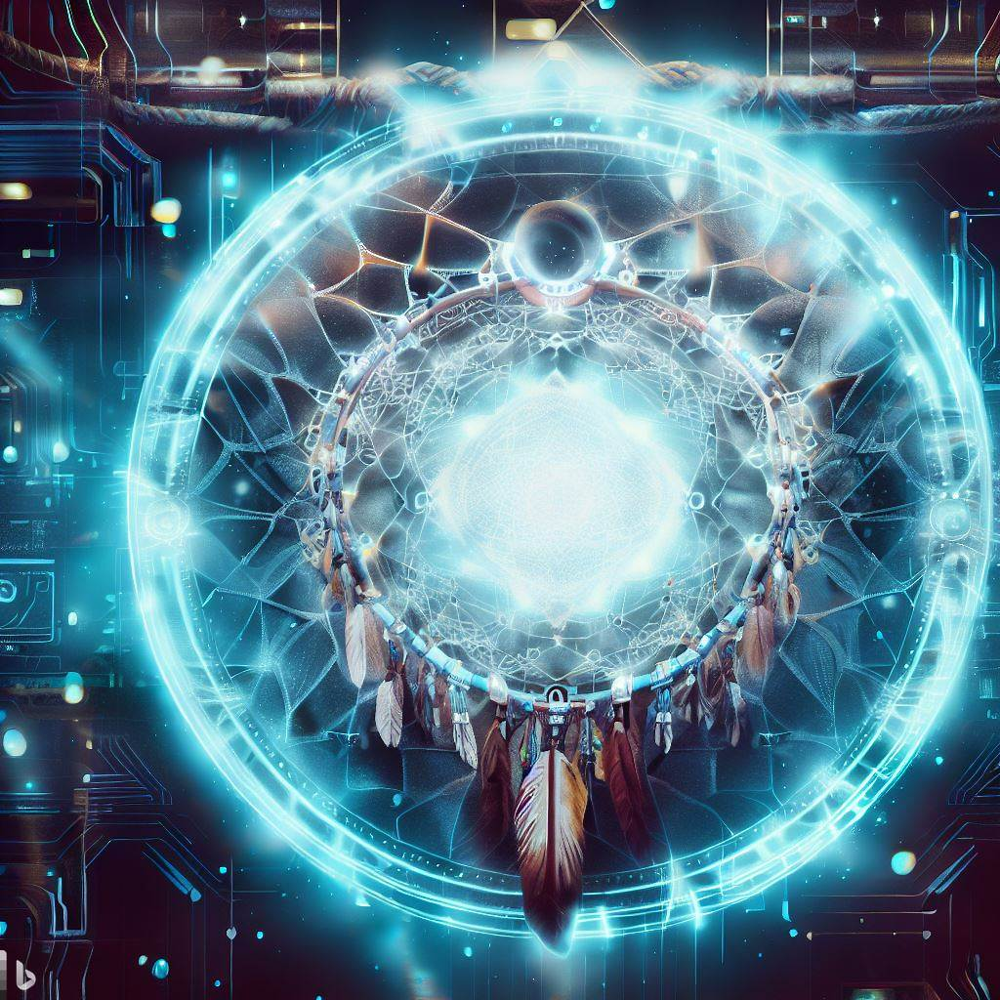
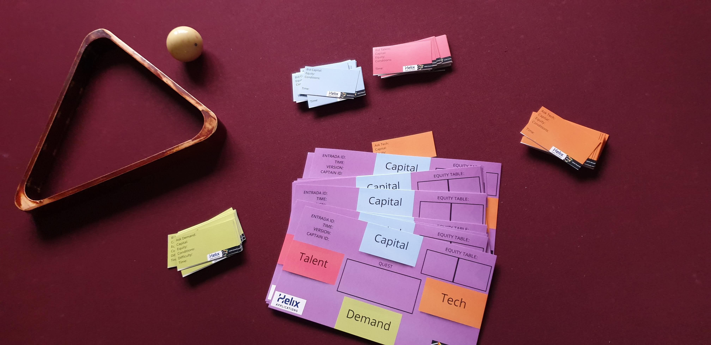

_"Unfolding the Dreamcatcher: The Confluence of Blockchain, AI, and NFTs in a New Era of Innovation Networks"_

<!--truncate-->

When it comes to technological innovation, the path forward is rarely a straight line. The journey is often filled with trials and tribulations, twists and turns, and a series of highs and lows. One such journey is the development of the Dreamcatcher, an innovative solution that combined the prowess of blockchain technology, the intellect of artificial intelligence (AI), and the uniqueness of non-fungible tokens (NFTs) to create a self-reinforcing innovation network. This blog post recounts the intricate journey that led to the Dreamcatcher's creation and explores its revolutionary potential. 

## From Blockchain to Innovation Networks

At the outset, the journey began with a high compute ability blockchain, which allowed for the creation of private chains and applications composed of many such chains. The potential of this technology was evident, yet a significant hurdle remained - charging for its use was a conundrum yet to be resolved. 

This uncertainty triggered internal pressures within the team. The question of how to adequately compensate our staff and external contributors for a valuable, yet uncertain asset - the blockchain - was a divisive issue.  We knew the primary value for us to unlock was an ecosystem - how could we capture a fair share of the value the applications generated, without smothering growth ? Simultaneously, we were grappling with another monumental challenge: how to leverage the blockchain to create a global innovation network - how could we have no staff whatsoever, and join the partners we wanted to enable in the ecosystem as participants ? The question was:

:::danger &nbsp; 
**How could the platform be a peer of the applications ? **
:::

## The Advent of the Dreamcatcher

In the midst of these challenges, we conceptualized the first rendition of the Dreamcatcher. It was a tangible entity that functioned as a board game and a paper version. This Dreamcatcher was our first stepping stone in the path toward a more comprehensive solution.

We carried on experimenting on paper and in text documents to try to get the protocol right, but it seemed increasingly difficult to make a simple model stick together in complex environments.

## The Intersection of NFTs and Task Attribution

Then NFTs blew up on the scene, and quickly grew to demonstrate multiple billions of dollars in yearly transactions.

The next breakthrough for the Dreamcatcher came when we realized, through the experience of [Satoshi Island](https://satoshi-island.com), where they had turned NFTs into land, that tasks could be turned into NFTs. This realization opened up a world of possibilities for task attribution and compensation.

This provided a way to make a simple protocol based on the ERC-1155 token standard, that could apply to a large number of complex use cases.  No sooner had this model been contained when along came ChatGPT...

## Enter AI

Suddenly we looked at the large compute capacity blockchain we had been working on, and saw it could be quite simply utlized to run AI models.  A blockchain native AI had its uses for sure, but we caught a glimpse of something more fundamental - fairness.

The greatest innovation network possible is one that is the fairest to all participants.  Our goal was to ensure fairness of reward for all participants and we now had a protocol that could generate a dataset about that very thing in a nice compact and standard form.  Most importantly, this dataset was immutable.

This means we can use the NFT task protocol as a dataset to train a blockchain-native AI that would provide instant and unbiased attribution based on the contribution patterns left by protocol usage.  

Think about that a second:  

:::tip &nbsp; 
**Instant unbiased fair reward for your permissionless labor and investment, in perpetuity**
:::

## The Dreamcatcher Today: A Self-Reinforcing Innovation Network

Today, we believe we have something extremely valuable in the Dreamcatcher. It can charge and reward anyone participating in the Dreamcatcher blockchain using the Dreamcatcher Protocol. This protocol immutably requests and records contributions for anything at all.

Though it might be possible to attempt fairness for tasks outside the Dreamcatcher protocol, our initial scope is limited to protocol activity as we build up.  One of the traits we knew a suitable Dreamcatcher design would possess is the ability to create and continually improve its own self, and so using this system, we are building this system and all the apps on top of it. 

The Dreamcatcher journey is a testament to the unpredictability and excitement of technological innovation. It underscores how technologies, when brought together, can create something truly unique and powerful. The fusion of blockchain, AI, and NFTs has not only resolved our initial challenges but also opened up new avenues for equitable innovation and collaboration.

As we continue on this journey, we remain steadfast in our commitment to foster a fair and robust innovation network. Through the Dreamcatcher, we hope to democratize the innovation process, providing every participant with the recognition and reward they deserve.

Here's to the journey ahead, and the many more exciting chapters to be added to the story of the Dreamcatcher, where the highlight must surely be what the Dreamcatcher has made.